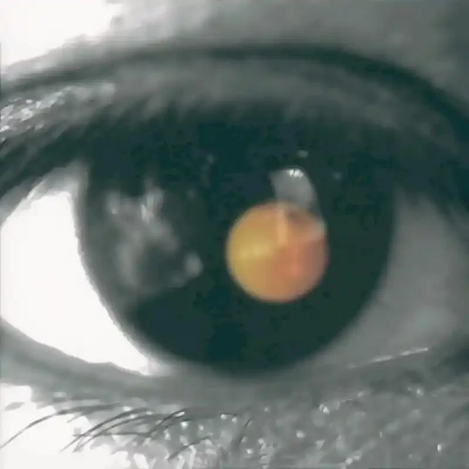

# 一些乐评

## **David Tao**

### 黑色柳丁
> 用音乐发起一场爱的革命。

**前言**

这是一个断断续续码了很久的坑——笔者在去北京玩的路上随手写了一下蓝砖乐评，虽然相当地不成熟，但在码字的过程中发现还挺有意思的，正好应8u的要求，再来一期！

于是一拖就是两个月hhh——当然，《黑色柳丁》这张专辑绝对值得你画上很长的时间细细执笔，无论是东西方音乐形态的混搭碰撞，还是专辑所要表达的政治讽刺、现实折射、反传统与性解放主题，都有太多值得说道的地方。实体专辑内页甚至写了一句非常大胆的话：**“陶喆一回来，台湾乐坛就要改朝换代！”**多年后回首，《黑色柳丁》的确做到了这点，在黑砖发行23年后的今天，专辑封面的这只眼睛，依然在审视着这个社会。

**什么是“黑色柳丁”？**

柳丁大致就是我们口中的脐橙。“台湾盛产这种水果，所以潜意识说到‘柳丁’就会想到台湾，继而想到华人。给柳丁冠上黑色就是象征着一种革命，希望大家去勇敢地面对台湾的黑色世界。”陶喆在纪录片《11号产房》中如是说。《黑色柳丁》这张专辑的封面由一只黑色的眼睛和一个从瞳孔中反射出的橘色柳丁构成，“黑色柳丁”表面喻指“黑色的台湾”，而更深层解释是柳丁象征太阳与希望，陶喆希望**用音乐来发起一场爱的革命，终有一日能将黑色的部分去除，重拾鲜艳夺目的橙色。**

**1.《黑色柳丁》**

虽然这张专辑称得上是“首首主打”，但《黑色柳丁》这首同名曲显然是全专最核心，也是笔者心目中陶喆艺术性和流行性结合的最好的佳作。前奏略显模糊的清音电吉他点弦勾勒出 Amadd9 和弦——这大概率预示着歌曲将基于小调展开——然而简短而阴郁的 intro 不给听众喘息的机会，随着滑音衔接至 Verse ，歌曲转入 A major 。（其实直接说A大调不是很严谨）

主歌部分人声如同刚刚睡醒般迷糊慵懒，刻意的 Lo-Fi 质感造就了略微扭曲的听感。背景吉他轻轻打底，double stop的演奏技法致敬了Jimi Hendrix。到了Pre-Chorus人声骤然开阔，右耳电吉他诡异凄惨的高音不时出现，做出相当丰富的表情；吉他手Bruce Waston通过移调夹的滑动与tape echo，带来了两个悦耳的滑音，致敬了《Space Oddity》（David Bowie, 1969）——细节的是，两次滑音的声道变化相向交织的。陶喆巧妙利用现实般扭曲与折叠的吉他音色，呈现出自我否定与怀疑的阴暗面，并在“我不是个英雄”的骤停完成情绪积累，为Chorus部分的爆发作铺垫。

进入Chorus，鲜明的Grunge风格扑面而来，情绪得到了大爆发——鼓与失真吉他猛烈冲击耳朵，华语流行歌曲中鲜有如此丰富重型的吉他编排。人声与Lo-fi和声的Call & Response象征着两个人格的斗争。这里还有一个玩味的设计——通常意义上，小调乐句会表达凄凉与悲伤，大调乐句会带来明亮与希望——而有意思的是，陶喆选择一反常态，在Verse部分用大调乐句描摹阴暗面心理，而在Pre-Chorus和Chorus部分用小调乐句象征与黑暗面激烈抗争的主人格。

第二段Chorus中弦乐拉升，配合急促地鼓与电吉他，好像在阴暗中拨开迷雾。第二段副歌结束后重回朦胧，一直到最后一句人声突然清晰后戛然而止，像是说了什么不该说的，被强行捂住了嘴。结尾的关闭电台音效与《今天晚间新闻》的丝滑衔接，体现了专辑曲目设计连贯性与概念完整性。当然，现在看来这已经是专辑制作人的基操，但就当年的华语主流来说，专辑概念的西式改良还是很值得肯定的。

有网友分析了《黑色柳丁》歌词表达的政治讽刺，笔者觉得有过度解读的嫌疑了，就不搬运了，原帖有兴趣的8u可以看看：[陶喆《黑色柳丁》这首歌好在哪些地方？- @指给我敌人在哪里 的回答](https://www.zhihu.com/question/25548957/answer/2978857833)

---

既然提到了曲目编排与概念设计，这里插播一个小故事：

> 2021年11月19日，Adele发行了个人第四张音乐专辑《30》。新专辑表现了她的自毁、自省再到自我救赎的心路历程，歌曲的顺序经过了她的精心编排，但是这张专辑中的概念性和故事性被Spotify的“shuffle（随机播放）”功能所打破，于是Adele强烈要求Spotify取消这一功能，按照艺术家的预设顺序播放专辑——幸运的是，Spotify最后真的同意了Adele的诉求。11月21日，Adele发布推文，称：“在不断变化的行业中这是我的唯一要求。我们并不会为如此精心制作的专辑无缘无故地设置曲目列表。我的作品在讲述故事，这故事也应当按照我的意图被倾听。感谢Spotify的倾听。”

现在，我们把目光从《30》转回《黑色柳丁》。

**2.《今天晚间新闻+Dear God》**

理论上，《黑色柳丁+今天晚间新闻+Dear God》是完整的一体——这里是因为文章太长了，笔者为了阅读体验才把3首歌解成2个部分展开，但是在听歌的过程中，曲目编排的完整性与流畅性应该得到尊重。但很可惜的是，《今天晚间新闻》是一首禁曲，主流音乐软件上是听不到的——原因倒是简单，新闻片段sample中出现了我们不承认的某些ww政治机构。但这很大程度上影响了专辑的丝滑听感。大家可以听听这个12分钟的视频，体会一下DT在曲目衔接设计的巧思：

《今天晚间新闻》采样了46段惊心动魄、荒诞黑暗的却又真实存在的新闻片段，并用电台播报噪声编织在一起。1分48秒时声场突然变化，哭泣中的人声转移到左声道，右声道金色的号声响起，很难不让人动容与愤怒。

> 妈妈，我好想你，我好想给你一个拥抱……

> 母亲节要到了，现在已经966天了，不可能放弃啦……

> 未来要如何重建，暂时还没有答案。

紧接着是两声气缸轰鸣的声音，让人心头骤然一紧。5秒钟的留白，让听众回味于黑色新闻的震撼之中，并完成情绪积累，在#F大调sol-la-do-re-mi的五声电吉他响起后达到高潮——《Dear God》，它来了。

“刚刚看完六点半的新闻”，首句歌词上作出衔接前一首曲目的设计；“那悲剧，又重演”“拿生命做赌注，这些疯狂还要多久”，陶喆在采访中说，这是一首表达大爱的歌曲，创作这首歌的动机是“911事件”。作为披头士的忠实粉丝，陶喆在Chorus部分借鉴了《Here, There And Everywhere》（The Beatles, 1966）的旋律，Outro部分致敬了《Hey Jude》（The Beatles, 1968）的自由即兴，陶氏怪叫又给笔者听设了。

> 刚刚看完远方传来的消息

> 像噩梦

> 在继续

> 给点力量让自己能活下去

> Dear god

> 你在哪里

夸了这么多，也要来说说这张专辑不足与缺憾：

1. 千禧年初陶喆的嗓音还是太细腻了，演绎摇滚还是有些许teen pop味，如果交给给太平/69乐章时期的他来演绎可能会更加出彩；

2. 虽然前几首组曲定位概念清晰，很有态度，但就整张专辑而言，更适合做成双碟，或者直接发一张“黑柳+晚间新闻+Dear God+Angel+蝴蝶+摇篮曲”组成的EP——前半张与后半张风格有些许割裂，难免会被人批评统筹失措——当然，你也可以理解成两种风格是DT的两个人格的折射；

3. 这张专辑采样与致敬的部分还是多了些，有传言称除却政治讽刺之外，这也是黑砖在第14届台湾金曲奖上挂零的原因之一；

批评的话语是老生常谈，成熟的制作成色让你不得不承认，它是一张非常好听与精致的专辑。

---

假如你是陶喆，你借《黑色柳丁》表达了自己的无助，借《Dear god》表达对现状的愤懑，自然有破无立，光是批判是不行的——在下一首歌曲中，你必然会安排一首歌治愈听众，最好是借一个人来抚慰破碎的心灵，那么这个人会是谁呢？

**答案，就藏在下一首歌的标题中。**

**3.《Angel》**

关于这首歌的背景故事，百度百科如是写道：
> 2002年初，陶喆在洛杉矶为专辑《黑色柳丁》筹备录音工作，恰巧梅艳芳到洛杉矶表演，顺道留下探班。陶喆是个工作狂，梅艳芳每天都到录音室陪陶喆。而后，陶喆录了一首歌曲《Angel》，但他并不喜欢该曲，本不打算收录在专辑中。但梅艳芳听完后十分喜欢，并让陶喆一定要收录这首歌曲，梅艳芳认为这首描写女人夜晚归家的歌曲很能打动女人心。陶喆听罢，十分尊重梅艳芳的意见，就将该曲收录在专辑中。”

在这首歌中，陶喆用几乎不加修饰的唱腔道出朴素真挚的歌词，I-V-VIm7add11-IV6/9四个和弦的循环如同白描一般，伴随温柔的尼龙吉他（这里笔者尚未仔细考证到底用的什么吉他）、提琴和长笛，共同营造出哀而不伤的氛围。Interlude之后的一小段中，老大编排了《Strawberry Fields Forever》（The Beatles, 1967）前奏同款温柔的mellotron（一种电子琴），真不愧是披头士铁粉啊。最后一段Chorus，刻意做小声场、隐隐咆哮的电吉他响起，进一步治愈心灵——但这还没完，歌曲以小二度收束，和弦并未解决，预示着治愈尚未完成，为《蝴蝶》作了预告。

> 像条船在海上漂 北斗星也看不到

> 谁能够扬起了帆 远远离开这黑潮

> Angel Angel 盼望你在我身边

> Angel Angel 请你紧紧抓住我的手

试想一下，一个成年男人矫情地盼望天使来到身边，渴求天使不要离开，那他是该有多么孤独与无助啊。

**4.《蝴蝶》**

有人说，没有前奏的歌像是被强吻，窒息又上头——《蝴蝶》就是这样一首“零帧起手”的歌曲。当然，时下能撇去浮躁，静下来完整欣赏一首歌长长的前奏，好像已经变成了一件奢侈的事——《以父之名》长达100秒的intro一定会把你劝退（笑）。

Verse部分孤独的柱式和弦与一支提琴伴随人声，就好像让人看到了黎明前一个满身伤痕的人从废墟里醒来。沙哑的钢琴、滋滋的电吉他和略显粗糙的混音，老大自己都吐槽这首歌像是一支demo而不像是成品，于是在20多年后请吴庆隆老师重新编曲了一版——但是巧了，笔者还偏偏就是很喜欢专辑版这种原始粗粝的流摇质感，充满了生命力。第二遍主歌中，左右声道电吉他就像是在与人声对话，张弛有道；歌曲的bridge段落神仙般地加入温柔而坚定的doo-wop和声群，鼓点和钢琴由破碎到集中，伴随着C5高音的爆发和顺理成章的升key，仿佛让听众看到一个伤兵从废墟中站起——蝴蝶飞过废墟，治愈了《黑色柳丁》前半张的伤痛与不平。

> 每次一想到你

> 就心存感激

> 现在我能坦然面对自己

> 我会永远珍惜

> 我会永远爱你

> 在我心底的你位置没有人

> 能代替

有人说，《蝴蝶》是一首情歌，也有人说这是一支写给上帝的歌，是一首自我救赎之歌——曾经有无数失意的时刻，都有《蝴蝶》这首歌陪伴着笔者度过漫漫长夜。歌曲不仅仅是高级的作曲，华丽的辞藻，动人的演唱，炫技的编曲与精湛的制作，可能这些要素的有机结合可以形成一首所谓的好歌——但笔者更在意可能是作者意图传递的人文关怀与精神力量，就像《太聪明》只用了一把木吉他和一支双簧管，就像《简单爱》只是恰如其名简简单单组合了midi吉他、鼓组和贝斯与和声群，并不妨碍它们成为经典。只有歌曲寄托了真情实感，旋律才有了意义。

**【扩展阅读：Grunge】**
> 垃圾摇滚（Grunge），有时也被称作西雅图之声（Seattle Sound）或“邋遢摇滚”、“油渍摇滚”，是一种隶属于独立摇滚（Indie rock）的音乐流派，它由硬核朋克，重金属和独立音乐发展演变而来。一批来自美国西海岸城市（包括华盛顿州的西雅图和奥林匹亚，以及俄勒冈州的波特兰）的乐队，创造了垃圾摇滚音乐，而且很快让这种音乐在流行音乐的听众间传播。这种音乐类型与美国的X世代紧密相联。

> 垃圾摇滚以The Stooges和Black Sabbath模糊、黑暗的声音作为基础，是重金属和朋克的混合物，可以看到70年代的经典摇滚乐（Neil Young、Led Zeppelin）以及学院摇滚（Pixies、Sonic Youth、R.E.M.）的影子。尽管吉他演奏是直接来自70年代早期的金属，垃圾摇滚的风格完全和金属不同，不管是歌词的手法或是在音乐上的攻击性都来源于朋克，特别是80年代早期有着自由思想的美国硬核。垃圾摇滚乐队的第一波浪潮的音乐——Green River、Mudhoney、Soundgarden——比第二波（开始于Nirvana）更重。Nirvana不仅旋律比他们的前辈更为优美，还以“stop-start”的特点著称，他们失真，扭曲的吉他声几乎成了这个风格的象征。在Nirvana成为主流后，垃圾摇滚失去了许多它本质的自由和与朋克的联系，并且成为了在90年代重型摇滚中最流行的风格。

**参考资料**

[1][【Bilibili】陶喆 11号产房 黑色柳丁专辑制作花絮，华人唱片第一部幕前幕后实况电影 - @陶喆歌迷会](https://www.bilibili.com/video/BV19s411L7c8/?spm_id_from=333.337.search-card.all.click&vd_source=3425d07e5e531d2770a4799181a79640)

[2][【Bilibili】陶喆神專《黑色柳丁》誕生全記錄：我看我的第一部音樂紀錄片《十一號產房》｜《陶喆回憶殺DT’s Throwback Thursday 》- @陶喆的音乐产房](https://www.bilibili.com/video/BV1Bp4y1h7AV/?spm_id_from=333.337.search-card.all.click&vd_source=3425d07e5e531d2770a4799181a79640)

[3][【Bilibili】陶喆親自解析《黑色柳丁》背後的創作秘密+黑柳『全新編曲』搶先揭露！｜【創作喆學 DT “How I made It？”】](https://www.bilibili.com/video/BV17Y4y1Y72k/?spm_id_from=333.1391.0.0)

[4][【Bilibili】随机播放按键要取消了?陶喆告诉你很有必要!黑色柳丁全解析 - @HOPICO](https://www.bilibili.com/video/BV15r4y1Q7R3/?spm_id_from=333.337.search-card.all.click&vd_source=3425d07e5e531d2770a4799181a79640)

[5][【Fri. Review】 黑色柳丁 - 陶喆 (2002) - @UPEE](https://mp.weixin.qq.com/s/of8RubesKQWhODnKTfk7YQ)

[6][《黑色柳丁》| 没有革命的爱是梦，没有爱的革命是暴动 -  @佐佐考啥都过](https://mp.weixin.qq.com/s/W2YKipCSc8L2PIn4MamGbA)

[7][如何评价《黑色柳丁》这张专辑？- @莫斯科的异乡人](https://www.zhihu.com/question/22396774/answer/10011664214)

[8][《黑色柳丁》陶喆 - @半岛铁头](https://zhuanlan.zhihu.com/p/580983794)

[9][Adele推动Spotify取消专辑“随机播放”，但用户就能从头到尾听完一张专辑吗？- 澎湃新闻](https://m.thepaper.cn/baijiahao_15727500)

## **Jay Chou**